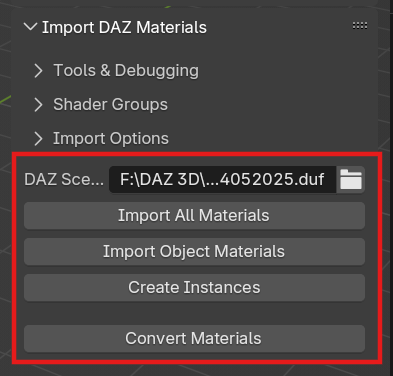
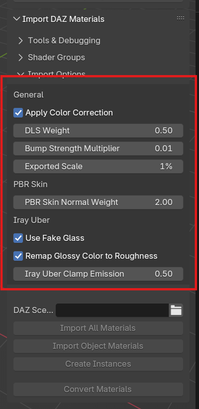

# DAZ Materials to Blender

Yet another implementation of a bridge.

Yet this one tries to keep things simple.  
The user decides exactly what gets exported from DAZ and imported in Blender (and how).
This bridge just copies materials and sets them up in Blender.

## What does it do

Imagine this: You've tried using the [Daz to Blender Bridge](https://www.daz3d.com/daz-to-blender-bridge), it looked
promising but...
You've posed your figures and created a massive scene. It's beautiful! But we want to render it in Blender and maybe do
some adjustments DAZ does not allow?
Yes, so you get going, exporting your figures, one by one to Blender. But you hit a few snags...
The figures are no longer posed, materials are simplisticly setup to say the least... As for the scene itself, Yeah,
there's no options there...

_Side note: There's [Diffeomorphic](https://bitbucket.org/Diffeomorphic/import_daz/wiki/Home), a good solution! However,
I found that it's just far to much for my use-case._

In comes this plugin. It reads material data from `.duf` scene files and sets them up for the corresponding objects in
Blender.

There is ALOT to talk about and this README doesn't even scratch the surface, but do read on, as it at least covers the
basics.
Check out the [usage](#basic-usage) below!

## Basic Usage

_(!) You will find the UI for this plugin in the `Shader Node Editor` as well as the `3D Vieport`
under `Juraji's Tools`!_

### In DAZ Studio

1. Set up your scene. _You know how this works._
2. Save your scene and remember where. _A good Studio user knows to save often._
3. Export you figures and environment.
    - Use `FBX` if you need rigging.
    - Use `OBJ` if you just need the mesh.
    - In my experience I've found it better to export each figure and the environment into their own files. Keeps things
      managable and undo-able.
    - Check out the settings above. Especially the `Write Groups` and `Write Surfaces` settings. _You can write
      the MTLs, but we're going to ignore them later anyway._

### In Blender

1. Import the `OBJ`s and/or `FBX`s you've exported from DAZ.  
   _IMPORTANT: Do NOT rename any objects or materials! This plugin uses some real magic to determine which material in
   the `.duf` file belongs to which object/material._
2. In your 3D Viewport, click the `Juraji's Tools`-tab and you should see a panel like the image on the right.
3. Select your DAZ scene file (`.duf`).
4. Click `Import All Materials`.
5. Blender should freeze for a moment and if all went well all of your objects should have the correct materials set up.

## Supported Shaders

* DAZ PBR Skin
* Iray Uber _(with handling for Metallicity/Roughness, Specular/Glossiness and Weighted sub-shaders)_
* iWave's Translucent Fabric Shader _(My personal favorite)_

If a material uses a shader the plugin does not know, it will set up the material with a white Principled BSDF and adds
all images it finds as Texture nodes.  
All images are set to the `sRGB` colorspace. You will have to figure out the color spaces (sRGB, Non-Color, etc.) and
how the maps should be linked up. But at least this handles the great image-map search for you.

_I've implemented just the shaders I personally use. If you find that a certain shader should be added and are willing to
contribute, shoot a pull-request and we'll work things out!_

## Deep Dive

The defaults should work for most simple setups, but sometimes you need more control.

K, to understand what the options mean and what you can do with them, we first need to pass exactly what this plugin
does.

In short: It uses a set of Node Groups that (mostly) mimic DAZ Studio's shaders. Thus, you have a group called "PBR
Skin"-group for the PBRSkin shader and the "Iray Uber"-group for the Iray Uber shader.  
When reading a material from the scene `.duf` file it tries to find the matching shader group. The shader group has
inputs that match the properties in DAZ Studio, so it just maps one to the other. Note that the DAZ Studio shaders are
not exactly re-created, as some properties are simply not applicable and others are not supported or deemed too
computationally complex.

Doing it this way allows you to easily fix properties and adjust how your material looks in Blender. If so inclined you
are even free to pick apart the groups and roll your own.

K, now for the ALL the UI properties. _I do encourage you to hover over the options in the UI, as their tooltips will be
the
most up-to-date._

### Tools & Debugging

I like to write my debuggin tools directly into the software I make. Two reasons: 1. Buttons are easier than hidden
switches, 2. They might be useful to the user as well.

#### Export DAZ Materials as JSON

This will create a `JSON` formatted file next to the Blender save file,
containing ALL properties the plugin was able to read from the DAZ `.duf` file.

#### Delete All Groups

This will delete all groups from the Blender data blocks that are created by this plugin.  
_Note that this is a slight hack, as it looks at the group's description._

### Shader groups

As explained earlier in the deep-dive, this plugin uses node groups to represent DAZ Shaders. The Import action will
automatically create any group it needs to fulfill the import requirements. So if you scene uses the PBRSkin shader, it
will create that group. The same goes for the others.

However, either using this plugin for export or not, you might find one or more of these groups usefull for your own
creation.  
To that I say Cheers and Worry not. Under the Shader Groups panel, you'll find a button for each node group this plugin
uses.

#### Support

These groups are "small" pieces of the shader stacks that make up the full shader groups. You should check them out,
they might prove useful.

### Shaders

These are the full-blown mimic shader groups. Each has options gallore!

### Import Options

#### Renaming

Enabling these options will rename the objects in the outliner to their DAZ Equivalents.  
_IMPORTANT: This breaks the link between DAZ scene nodes and Blender objects. Meaning the import can not be run
again._

#### General

These options apply to all shaders.

#### PBR Skin, Iray Uber, etc.

These options apply to specific shaders.

## Special Thanks
While I wrote this plugin mostly by myself there are some credits to mention:

* [Blender Guru](https://www.blenderguru.com) Especially for the base of the "Fake Glass" shader group. A lot of headaches have been saved!  
Check out [this video](https://www.youtube.com/watch?v=KyXRBu7gn2o), where he explains exactly why it's better than just shoving in a Glass BSDF:

